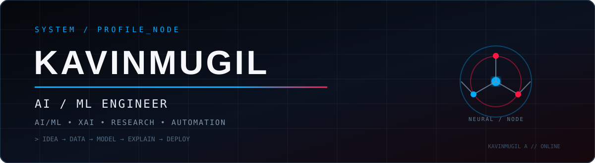
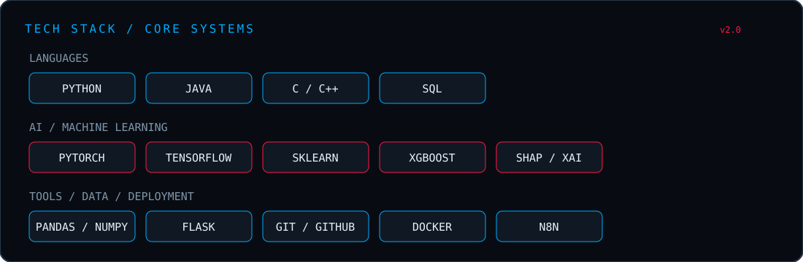
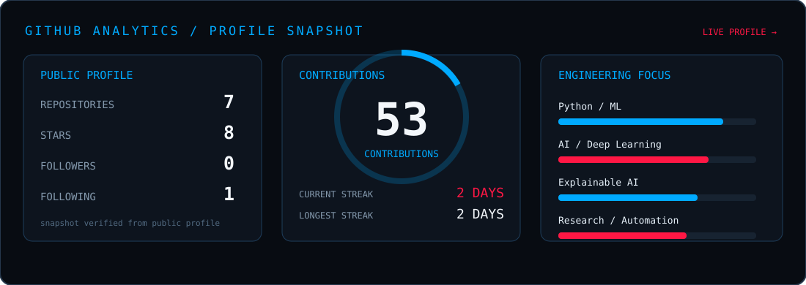
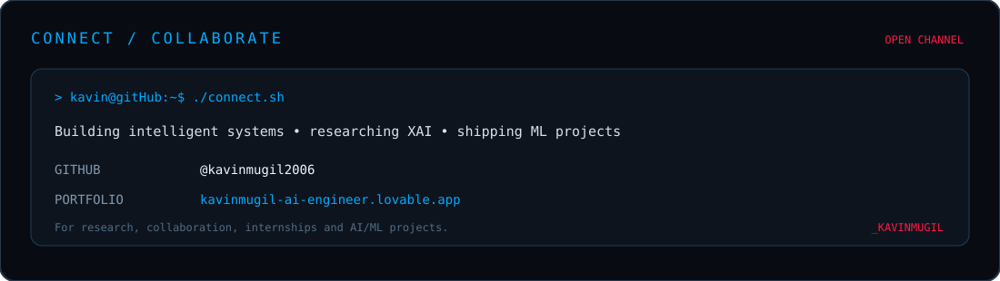

<div align="center">



<br><br>

<a href="https://github.com/kavinmugil2006"></a>
<a href="https://kavinmugil-ai-engineer.lovable.app"></a>


<br><br>

**AI & Data Science Engineering Student** building practical machine-learning systems, exploring explainable AI, and turning research ideas into working software.

`AI/ML` · `Deep Learning` · `XAI` · `Reinforcement Learning` · `Data Science` · `Automation`

</div>

---

## `01 // ABOUT ME`

```text
┌──────────────────────────────────────────────────────────────┐
│  KAVINMUGIL A                         AI / ML ENGINEER        │
├──────────────────────────────────────────────────────────────┤
│  ▸ Build practical ML systems                                 │
│  ▸ Research Explainable AI + Reinforcement Learning           │
│  ▸ Work with real-world datasets and model evaluation         │
│  ▸ Turn experiments into usable applications                  │
│  ▸ Interested in research, automation and deployment          │
└──────────────────────────────────────────────────────────────┘
```

---

## `02 // TECH STACK`

<div align="center">

</div>

---

## `03 // FEATURED PROJECTS`

<table>
<tr>
<td width="50%" valign="top">

### `01` — Fraud Job Detector

**[View repository →](https://github.com/kavinmugil2006/fraud-job-detector)**

A comparative ML/DL study for fraudulent job-posting detection using SVM, XGBoost, BERT, BiLSTM and Transformer models, with a Flask web application.

**Research:** NLP · Classification · Model Comparison · Explainability

**Result:** tuned SVM reached **F1 = 0.913** on the project benchmark.

</td>
<td width="50%" valign="top">

### `02` — DQN + SHAP Path Planning

**[View repository →](https://github.com/kavinmugil2006/dqn-shap-path-planning)**

Explainable reinforcement-learning work combining a Deep Q-Network with SHAP to make navigation decisions easier to interpret.

**Research:** RL · XAI · DQN · SHAP · Robotics

</td>
</tr>
<tr>
<td width="50%" valign="top">

### `03` — Automation / n8n

**[View repository →](https://github.com/kavinmugil2006/n8n)**

Workflow automation experiments focused on connecting tools, APIs and repeatable processes.

**Focus:** Automation · APIs · Workflow Engineering

</td>
<td width="50%" valign="top">

### `04` — AI/ML Research

**[View repository →](https://github.com/kavinmugil2006/ieeepaper)**

Research-oriented work and supporting material around applied AI/ML experimentation and publication work.

**Focus:** Research · Experiments · Applied AI

</td>
</tr>
</table>

---

## `04 // RESEARCH VECTOR`

```text
╔══════════════════════════════════════════════════════════════╗
║                         RESEARCH VECTOR                      ║
╠══════════════════════════════════════════════════════════════╣
║                                                              ║
║  [01] Explainable Artificial Intelligence                    ║
║  [02] Reinforcement Learning                                 ║
║  [03] Fraud / Anomaly Detection                              ║
║  [04] Natural Language Processing                            ║
║  [05] Applied Machine Learning                               ║
║  [06] Intelligent Automation                                 ║
║                                                              ║
╚══════════════════════════════════════════════════════════════╝
```

---

## `05 // GITHUB ANALYTICS`

<div align="center">

</div>

> **Note:** this section intentionally uses a repository-hosted SVG rather than fragile third-party stats cards. The numbers are a profile snapshot; GitHub's own profile remains the live source for current activity.

---

## `06 // CURRENT MODE`

```text
┌──────────────────────────────────────────────────────────────┐
│ STATUS      : ONLINE                                         │
│ MODE        : BUILD                                          │
│ FOCUS       : AI / ML + RESEARCH                             │
│ PIPELINE    : IDEA → DATA → MODEL → EXPLAIN → DEPLOY         │
│ NEXT        : MORE RESEARCH • MORE SYSTEMS • MORE SHIPPING   │
└──────────────────────────────────────────────────────────────┘
```

---

## `07 // CONNECT`

<div align="center">

</div>

<div align="center">

<a href="https://github.com/kavinmugil2006"></a>
<a href="https://kavinmugil-ai-engineer.lovable.app"></a>

</div>

---

<div align="center">

```text
> BUILD INTELLIGENT SYSTEMS.
> EXPLAIN THE DECISIONS.
> DEPLOY THE RESULTS.
```

</div>
